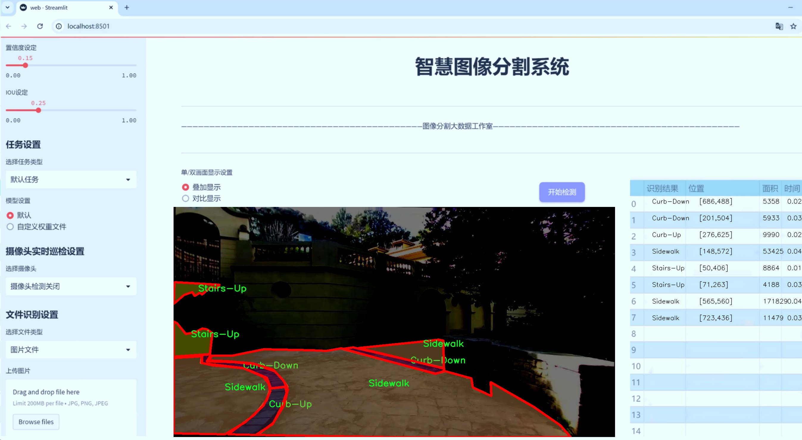
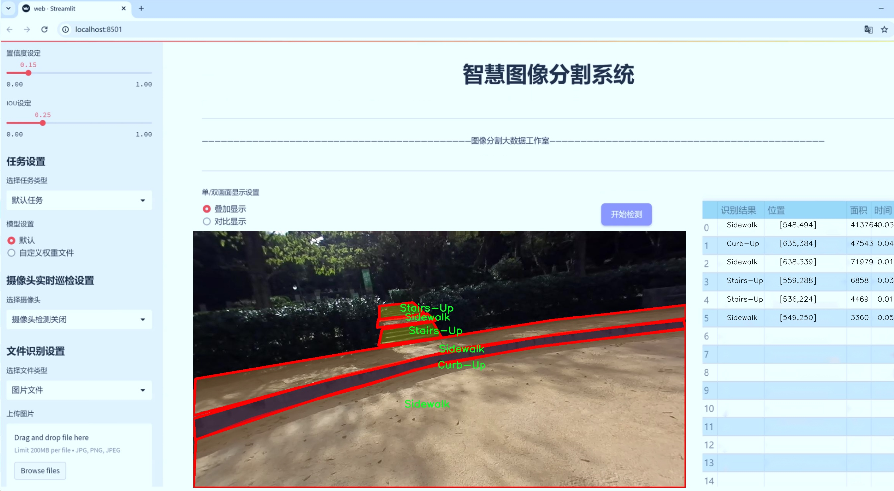
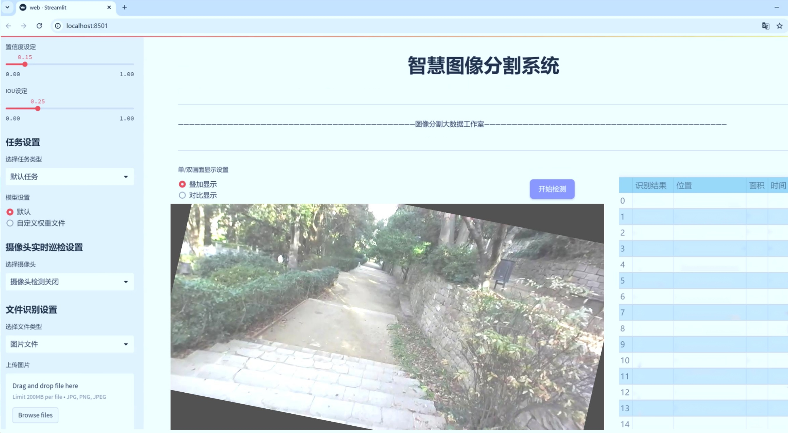
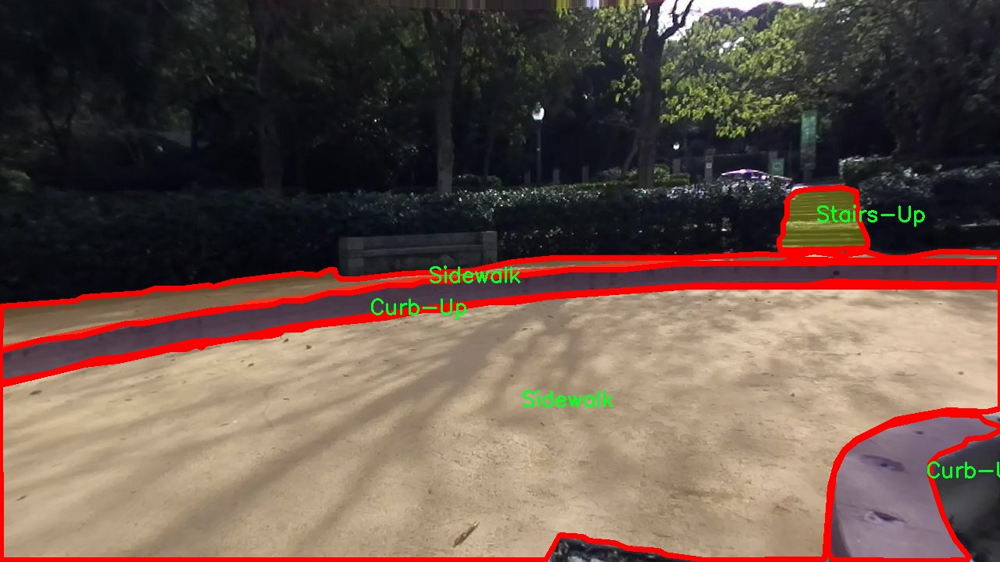
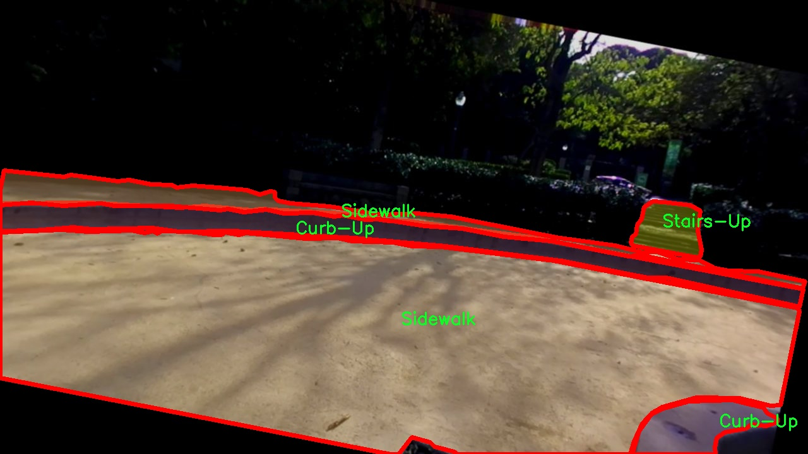
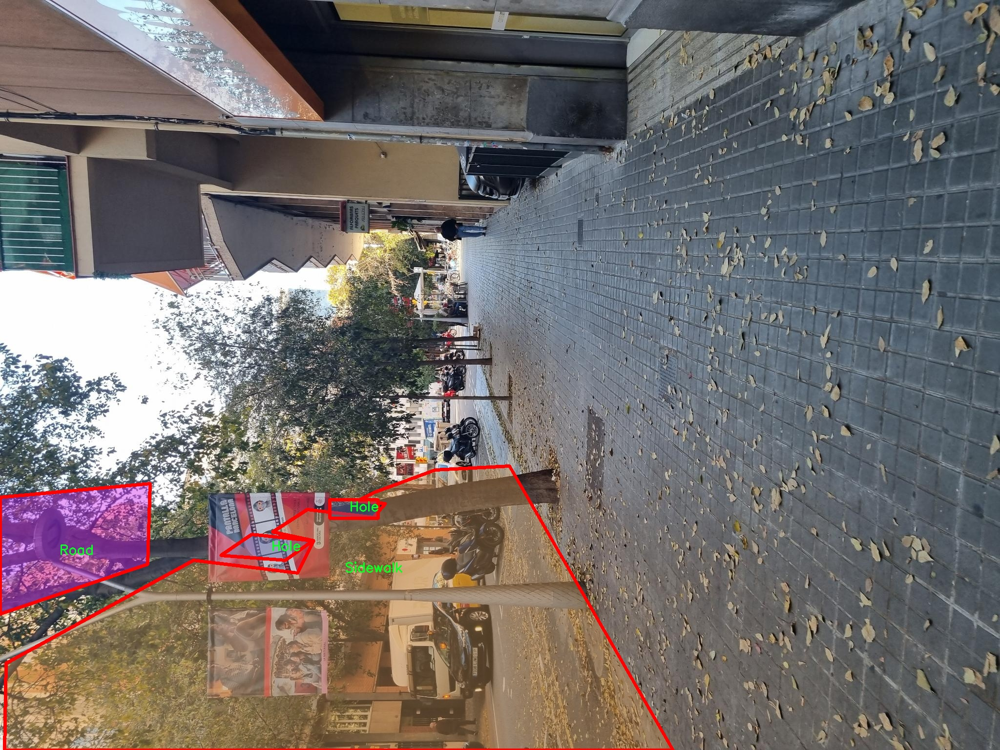
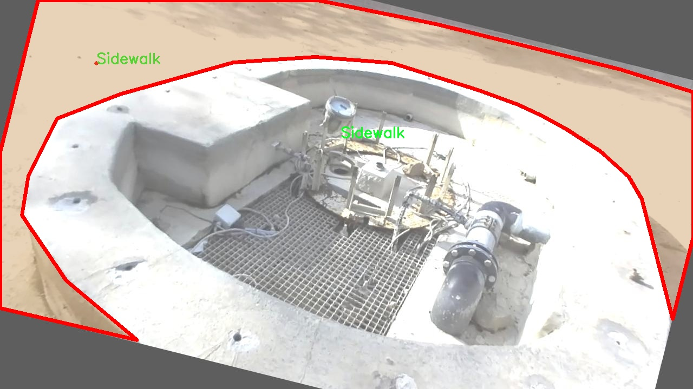
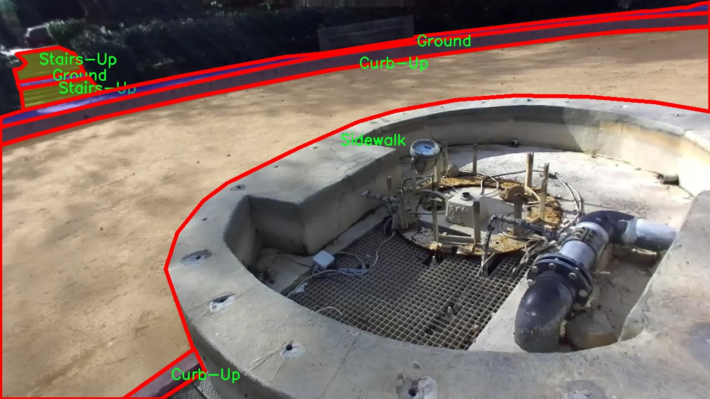

# 城市步行障碍物分割系统： yolov8-seg-dyhead

### 1.研究背景与意义

[参考博客](https://gitee.com/YOLOv8_YOLOv11_Segmentation_Studio/projects)

[博客来源](https://kdocs.cn/l/cszuIiCKVNis)

研究背景与意义

随着城市化进程的加快，城市步行环境的复杂性和多样性日益增加，步行障碍物的存在对行人安全和出行便利性造成了显著影响。尤其对于老年人、残障人士及儿童等特定人群，步行障碍物的识别与处理显得尤为重要。因此，开发一个高效的城市步行障碍物分割系统，能够有效识别和标记城市环境中的各种障碍物，具有重要的现实意义和应用价值。

在此背景下，YOLO（You Only Look Once）系列目标检测算法因其高效性和实时性而受到广泛关注。YOLOv8作为该系列的最新版本，结合了深度学习的先进技术，能够在复杂的城市环境中实现高精度的目标检测与分割。通过对YOLOv8的改进，能够进一步提升其在城市步行障碍物分割任务中的表现，尤其是在处理多类别障碍物时的精确度和鲁棒性。

本研究选用“Barcelona Streets”数据集作为实验基础，该数据集包含6800张高质量的城市街道图像，涵盖了10类不同的障碍物，包括人行道、路缘、楼梯等。这些类别的多样性使得模型在训练过程中能够学习到丰富的特征，有助于提高分割精度。数据集中每个类别的细致标注，为模型的训练提供了坚实的基础，使得最终的分割系统能够在实际应用中表现出色。

在实际应用中，步行障碍物的自动识别和分割不仅可以为城市规划和交通管理提供数据支持，还能为智能出行、无障碍设计等领域提供技术保障。通过准确识别障碍物，相关部门可以及时进行维护和改进，提升城市步行环境的安全性和可达性。此外，基于该系统的智能手机应用或导航系统，能够为用户提供实时的步行路线规划，避开潜在的障碍物，提升行走的安全性和舒适度。

总之，基于改进YOLOv8的城市步行障碍物分割系统的研究，不仅是对现有目标检测技术的进一步探索与应用，也是对提升城市步行环境质量的重要贡献。通过有效识别和处理步行障碍物，能够为构建更加友好、安全的城市环境提供有力支持，促进社会的可持续发展。因此，本研究具有重要的理论价值和广泛的实际应用前景。

### 2.图片演示







注意：本项目提供完整的训练源码数据集和训练教程,由于此博客编辑较早,暂不提供权重文件（best.pt）,需要按照6.训练教程进行训练后实现上图效果。

### 3.视频演示

[3.1 视频演示](https://www.bilibili.com/video/BV1j3USY8E66/)

### 4.数据集信息

##### 4.1 数据集类别数＆类别名

nc: 10
names: ['Crosswalk', 'Curb-Down', 'Curb-Up', 'Floor', 'Ground', 'Hole', 'Road', 'Sidewalk', 'Stairs-Down', 'Stairs-Up']


##### 4.2 数据集信息简介

数据集信息展示

在城市步行障碍物分割系统的研究中，数据集的选择与构建至关重要。本项目采用的“Barcelona Streets”数据集专门针对城市环境中的步行障碍物进行标注与分类，旨在为改进YOLOv8-seg模型提供高质量的训练数据。该数据集的设计充分考虑了城市步行环境的复杂性和多样性，涵盖了多种常见的步行障碍物，以便于模型在实际应用中能够更好地识别和分割这些障碍物。

“Barcelona Streets”数据集包含10个类别，分别为：人行道（Sidewalk）、路面（Road）、地面（Ground）、楼梯（Stairs-Down 和 Stairs-Up）、路缘（Curb-Down 和 Curb-Up）、交叉口（Crosswalk）、孔洞（Hole）以及地板（Floor）。这些类别的选择不仅反映了城市步行环境中的实际情况，也为模型的训练提供了丰富的样本。这些障碍物在城市步行过程中可能会对行人造成影响，因此，准确地识别和分割这些障碍物对于提升行人安全和行走体验具有重要意义。

数据集中每个类别的样本均经过精细标注，确保模型在训练过程中能够学习到每种障碍物的特征和边界。例如，交叉口（Crosswalk）作为一个重要的交通设施，其标注不仅包括交叉口的形状和位置，还考虑了周围环境的影响，以便模型能够在不同的光照和天气条件下准确识别。此外，路缘（Curb-Down 和 Curb-Up）类别的样本则特别关注于不同高度的路缘对行人行走的影响，这对于提升模型的分割精度至关重要。

数据集的构建过程中，研究团队还特别关注了样本的多样性和代表性。通过在巴塞罗那的不同区域进行数据采集，确保了数据集能够覆盖各种城市步行环境，包括繁忙的商业区、安静的居民区以及多样的公共空间。这种多样性使得模型在训练时能够接触到不同的场景变化，从而提高其在实际应用中的鲁棒性和适应性。

此外，为了增强模型的泛化能力，数据集中还包含了不同天气条件和时间段下的样本。这种设计不仅有助于模型学习到不同环境下的障碍物特征，还能提高其在实际应用中的表现。通过对数据集的精心设计与构建，研究团队希望能够为YOLOv8-seg模型的训练提供一个全面而富有挑战性的环境，从而推动城市步行障碍物分割技术的发展。

总之，“Barcelona Streets”数据集的构建充分考虑了城市步行环境的复杂性与多样性，为改进YOLOv8-seg模型提供了丰富的训练数据。通过对障碍物的精细标注和多样化样本的选择，该数据集不仅为模型的训练奠定了坚实的基础，也为未来的研究提供了宝贵的资源。随着研究的深入，期望能够进一步提升城市步行环境的安全性和便利性，为行人创造更加友好的出行体验。











### 5.项目依赖环境部署教程（零基础手把手教学）

[5.1 环境部署教程链接（零基础手把手教学）](https://www.bilibili.com/video/BV1jG4Ve4E9t/?vd_source=bc9aec86d164b67a7004b996143742dc)


[5.2 安装Python虚拟环境创建和依赖库安装视频教程链接（零基础手把手教学）](https://www.bilibili.com/video/BV1nA4VeYEze/?vd_source=bc9aec86d164b67a7004b996143742dc)

### 6.手把手YOLOV8-seg训练视频教程（零基础手把手教学）

[6.1 手把手YOLOV8-seg训练视频教程（零基础小白有手就能学会）](https://www.bilibili.com/video/BV1cA4VeYETe/?vd_source=bc9aec86d164b67a7004b996143742dc)


按照上面的训练视频教程链接加载项目提供的数据集，运行train.py即可开始训练



     Epoch   gpu_mem       box       obj       cls    labels  img_size
     1/200     0G   0.01576   0.01955  0.007536        22      1280: 100%|██████████| 849/849 [14:42<00:00,  1.04s/it]
               Class     Images     Labels          P          R     mAP@.5 mAP@.5:.95: 100%|██████████| 213/213 [01:14<00:00,  2.87it/s]
                 all       3395      17314      0.994      0.957      0.0957      0.0843

     Epoch   gpu_mem       box       obj       cls    labels  img_size
     2/200     0G   0.01578   0.01923  0.007006        22      1280: 100%|██████████| 849/849 [14:44<00:00,  1.04s/it]
               Class     Images     Labels          P          R     mAP@.5 mAP@.5:.95: 100%|██████████| 213/213 [01:12<00:00,  2.95it/s]
                 all       3395      17314      0.996      0.956      0.0957      0.0845

     Epoch   gpu_mem       box       obj       cls    labels  img_size
     3/200     0G   0.01561    0.0191  0.006895        27      1280: 100%|██████████| 849/849 [10:56<00:00,  1.29it/s]
               Class     Images     Labels          P          R     mAP@.5 mAP@.5:.95: 100%|███████   | 187/213 [00:52<00:00,  4.04it/s]
                 all       3395      17314      0.996      0.957      0.0957      0.0845


### 7.50+种全套YOLOV8-seg创新点加载调参实验视频教程（一键加载写好的改进模型的配置文件）

[7.1 50+种全套YOLOV8-seg创新点加载调参实验视频教程（一键加载写好的改进模型的配置文件）](https://www.bilibili.com/video/BV1Hw4VePEXv/?vd_source=bc9aec86d164b67a7004b996143742dc)

### YOLOV8-seg算法简介

原始YOLOv8-seg算法原理

YOLOv8-seg算法是YOLO系列的最新版本，结合了目标检测与图像分割的功能，标志着计算机视觉领域的又一次重大进步。该算法在YOLOv8s的基础上，针对图像分割任务进行了优化，充分利用了YOLO系列模型的高效性和准确性。YOLOv8-seg的设计理念是将目标检测与分割任务融合，使得模型不仅能够识别图像中的目标物体，还能精确地 delineate 这些物体的边界，进而为各种应用场景提供更为丰富的信息。

YOLOv8-seg的网络结构依然遵循了YOLO系列一贯的设计思路，主要由输入层、主干网络（Backbone）、特征提取层（Neck）和输出层（Head）组成。主干网络采用了CSPDarknet结构，进一步提升了特征提取的能力。CSPDarknet通过将特征图分为多个分支，利用残差连接的方式增强了信息流动，使得模型在训练过程中能够获得更为丰富的特征表达。具体而言，YOLOv8-seg引入了C2f模块，这一模块通过对输入特征图进行分支处理，能够在保持轻量化的同时，显著提高特征图的维度和表达能力。与前代模型相比，C2f模块在残差连接的设计上进行了优化，使得梯度信息能够更有效地传递，进而提升了模型的训练效率和最终的检测精度。

在特征提取方面，YOLOv8-seg采用了快速空间金字塔池化（SPPF）结构，旨在从不同尺度的特征中提取信息。这一设计使得模型能够有效应对多尺度目标的检测与分割任务，尤其是在复杂场景中，能够保持较高的检测精度和分割效果。通过这种特征金字塔网络（FPN）与路径聚合网络（PAN）的结合，YOLOv8-seg能够在特征图的处理上实现更高效的压缩与转换，从而为后续的目标检测和分割提供更加精准的基础。

在目标检测和分割的实现上，YOLOv8-seg采用了无锚框（Anchor-Free）的方法，这一创新使得模型在预测目标的中心点和宽高比时，不再依赖于预定义的锚框，从而减少了锚框数量，提升了检测速度和准确度。此方法不仅简化了模型的设计，还提高了模型在复杂场景下的适应性。与此同时，YOLOv8-seg的Head部分采用了流行的解耦合头结构，将分类和分割任务分开处理，进一步提升了模型的灵活性和性能。

在训练过程中，YOLOv8-seg引入了动态任务对齐分配策略（Task-Aligned Assigner），这一策略能够根据任务的复杂性动态调整样本的分配，从而提高训练的效率和效果。此外，模型在数据增强方面也进行了创新，特别是在最后10个训练周期中关闭了马赛克增强，以减少对模型训练的干扰，确保模型能够更好地学习到目标的特征。

损失函数的设计同样是YOLOv8-seg的一大亮点。模型采用了BCELoss作为分类损失，DFLLoss与CIoULoss作为回归损失，这种多损失函数的组合能够更全面地评估模型的性能，确保模型在目标检测和分割任务中的准确性和鲁棒性。

YOLOv8-seg的推出，不仅是YOLO系列模型的一次重要迭代，更是目标检测与图像分割领域的一次重要突破。通过结合最新的网络结构和训练策略，YOLOv8-seg在多个应用场景中展现出了卓越的性能，尤其是在实时检测和分割任务中，能够快速而准确地处理复杂的视觉信息。随着YOLOv8-seg的广泛应用，预计将为农业、安防、自动驾驶等多个领域带来深远的影响，推动计算机视觉技术的进一步发展。

总之，YOLOv8-seg算法通过高效的特征提取、灵活的网络结构设计以及创新的训练策略，成功地将目标检测与图像分割结合在一起，展现出强大的性能和广泛的应用潜力。随着研究的深入和技术的不断演进，YOLOv8-seg无疑将在未来的计算机视觉领域中占据重要地位。


### 9.系统功能展示（检测对象为举例，实际内容以本项目数据集为准）

图9.1.系统支持检测结果表格显示

  图9.2.系统支持置信度和IOU阈值手动调节

  图9.3.系统支持自定义加载权重文件best.pt(需要你通过步骤5中训练获得)

  图9.4.系统支持摄像头实时识别

  图9.5.系统支持图片识别

  图9.6.系统支持视频识别

  图9.7.系统支持识别结果文件自动保存

  图9.8.系统支持Excel导出检测结果数据


### 10.50+种全套YOLOV8-seg创新点原理讲解（非科班也可以轻松写刊发刊，V11版本正在科研待更新）

#### 10.1 由于篇幅限制，每个创新点的具体原理讲解就不一一展开，具体见下列网址中的创新点对应子项目的技术原理博客网址【Blog】：


[10.1 50+种全套YOLOV8-seg创新点原理讲解链接](https://gitee.com/qunmasj/good)

#### 10.2 部分改进模块原理讲解(完整的改进原理见上图和技术博客链接)【如果此小节的图加载失败可以通过CSDN或者Github搜索该博客的标题访问原始博客，原始博客图片显示正常】
### YOLOv8简介
YOLOv8目标检测算法继承了YOLOv1系列的思考,是一种新型端到端的目标检测算法,尽管现在原始检测算法已经开源,但是鲜有发表的相关论文.YOLOv8的网络结构如图所示,主要可分为Input输入端、Backbone骨干神经网络、Neck 混合特征网络层和Head预测层网络共4个部分.

YOLO目标检测算法是一种端到端的One-Slage 目标检测算法，其核心思想是将图像按区域分块进行预测。YOLO将输入图像按照32x32的大小划分成若干个网格，例如416x416的图像将被划分为13x13个网格。当目标物体的中心位于某个网格内时,该网格就会负责输出该物体的边界框和类别置信度。每个网格可以预测多个边界框和多个目标类别,这些边界框和类别的数量可以根据需要进行设置。YOLO算法的输出是一个特征图,包含了每个网格对应的边界框和类别置信度的信息呵。本文采用YOLO最新的YOLOv8模型，其是2022年底发布的最新YOLO系列模型，采用全新的SOTA模型，全新的网络主干结构,如图1所示。
整个网络分为Backbone 骨干网络部分和Head头部网络部分。YOLOv8汲取了前几代网络的优秀特性，骨干网络和 Neck部分遵循CSP的思想，将YOLOv5中的C3模块被替换成了梯度流更丰富C2模块,去掉YOLOv5中 PAN-FPN上采样阶段中的卷积结构,将Backbone不同阶段输出的特征直接送入了上采样操作,模型提供了N/S/M/L/X尺度的不同大小模型,能够满足不同领域业界的需求。本文基于YOLOv8模型设计番茄病虫害检测系统，通过配置模型参数训练番茄图像,得到能够用于部署应用的最优模型。


### 感受野注意力卷积（RFAConv)
#### 标准卷积操作回顾
标准的卷积操作是构造卷积神经网络的基本构件。它利用具有共享参数的滑动窗口提取特征信息，克服了全连通层构造神经网络固有的参数多、计算开销大的问题。设 X R∈C×H×W
表示输入特征图，其中C、H、W分别表示特征图的通道数、高度、宽度。为了清楚地演示卷积核的特征提取过程，我们使用 C = 1 的例子。从每个接受域滑块中提取特征信息的卷积运算可以表示为:


这里，Fi 表示计算后每个卷积滑块得到的值，Xi 表示每个滑块内对应位置的像素值，K表示卷积核，S表示卷积核中的参数个数，N表示接收域滑块的总数。可以看出，每个滑块内相同位置的 feature共享相同的参数Ki。因此，标准的卷积运算并不能捕捉到不同位置所带来的信息差异，这最终在一定程度上限制了卷积神经网络的性能。 

#### 空间注意力回顾
目前，空间注意机制是利用学习得到的注意图来突出每个特征的重要性。与前一节类似，这里以 C=1为例。突出关键特征的空间注意机制可以简单表述为:这里，Fi 表示加权运算后得到的值。xi 和Ai 表示输入特征图和学习到的注意图在不同位置的值，N为输入特征图的高和宽的乘积，表示像素值的总数。


#### 空间注意与标准卷积运算
将注意力机制整合到卷积神经网络中，可以提高卷积神经网络的性能。通过对标准卷积运算和现有空间注意机制的研究，我们认为空间注意机制有效地克服了卷积神经网络固有的参数共享的局限性。目前卷积神经网络中最常用的核大小是 1 × 1和3 × 3。在引入空间注意机制后，提取特征的卷积操作可以是 1 × 1或3 × 3卷积操作。为了直观地展示这个过程，在 1 × 1卷积运算的前面插入了空间注意机制。通过注意图对输入特征图(Re-weight“×”)进行加权运算，最后通过 1 × 1卷积运算提取接收域的滑块特征信息。整个过程可以简单地表示如下:


 这里卷积核K仅代表一个参数值。如果取A i× ki 的值作为一种新的卷积核参数，有趣的是它解决了 1×1卷积运算提取特征时的参数共享问题。然而，关于空间注意机制的传说到此结束。当空间注意机制被插入到3×3卷积运算前面时。具体情况如下:


如上所述，如果取A的值 i × ki (4)式作为一种新的卷积核参数，完全解决了大规模卷积核的参数共享问题。然而，最重要的一点是，卷积核在提取每个接受域滑块的特征时，会共享一些特征。换句话说，每个接收域滑块内都有一个重叠。仔细分析后会发现A12= a21， a13 = a22， a15 = a24……，在这种情况下，每个滑动窗口共享空间注意力地图的权重。因此，空间注意机制没有考虑整个接受域的空间特征，不能有效地解决大规模卷积核的参数共享问题。因此，空间注意机制的有效性受到限制。 

#### 创新空间注意力和标准卷积操作
该博客提出解决了现有空间注意机制的局限性，为空间处理提供了一种创新的解决方案。受RFA的启发，一系列空间注意机制被开发出来，可以进一步提高卷积神经网络的性能。RFA可以看作是一个轻量级即插即用模块，RFA设计的卷积运算(RFAConv)可以代替标准卷积来提高卷积神经网络的性能。因此，我们预测空间注意机制与标准卷积运算的结合将继续发展，并在未来带来新的突破。
接受域空间特征:为了更好地理解接受域空间特征的概念，我们将提供相关的定义。接收域空间特征是专门为卷积核设计的，并根据核大小动态生成。如图1所示，以3×3卷积核为例。在图1中，“Spatial Feature”指的是原始的Feature map。“接受域空间特征”是空间特征变换后的特征图。

 

由不重叠的滑动窗口组成。当使用 3×3卷积内核提取特征时，接收域空间特征中的每个 3×3大小窗口代表一个接收域滑块。接受域注意卷积(RFAConv):针对接受域的空间特征，我们提出了接受域注意卷积(RFA)。该方法不仅强调了接收域滑块内不同特征的重要性，而且对接收域空间特征进行了优先排序。通过该方法，完全解决了卷积核参数共享的问题。接受域空间特征是根据卷积核的大小动态生成的，因此，RFA是卷积的固定组合，不能与卷积操作的帮助分离，卷积操作同时依赖于RFA来提高性能，因此我们提出了接受场注意卷积(RFAConv)。具有3×3大小的卷积核的RFAConv整体结构如图所示。


目前，最广泛使用的接受域特征提取方法是缓慢的。经过大量的研究，我们开发了一种快速的方法，用分组卷积来代替原来的方法。具体来说，我们利用相应大小的分组卷积来动态生成基于接受域大小的展开特征。尽管与原始的无参数方法(如PyTorch提供的nn.())相比，该方法增加了一些参数，但它的速度要快得多。注意:如前一节所述，当使用 3×3卷积内核提取特征时，接收域空间特征中的每个 3×3大小窗口表示一个接收域滑块。而利用快速分组卷积提取感受野特征后，将原始特征映射为新的特征。最近的研究表明。交互信息可以提高网络性能，如[40,41,42]所示。同样，对于RFAConv来说，通过交互接受域特征信息来学习注意图可以提高网络性能。然而，与每个接收域特征交互会导致额外的计算开销，因此为了最小化计算开销和参数的数量，我们使用AvgPool来聚合每个接收域特征的全局信息。然后，使用 1×1 组卷积操作进行信息交互。最后，我们使用softmax来强调每个特征在接受域特征中的重要性。一般情况下，RFA的计算可以表示为:


这里gi×i 表示一个大小为 i×i的分组卷积，k表示卷积核的大小，Norm表示归一化，X表示输入的特征图，F由注意图 a相乘得到 rf 与转换后的接受域空间特征 Frf。与CBAM和CA不同，RFA能够为每个接受域特征生成注意图。卷积神经网络的性能受到标准卷积操作的限制，因为卷积操作依赖于共享参数，对位置变化带来的信息差异不敏感。然而，RFAConv通过强调接收域滑块中不同特征的重要性，并对接收域空间特征进行优先级排序，可以完全解决这个问题。通过RFA得到的feature map是接受域空间特征，在“Adjust Shape”后没有重叠。因此，学习到的注意图将每个接受域滑块的特征信息聚合起来。换句话说，注意力地图不再共享在每个接受域滑块。这完全弥补了现有 CA和CBAM注意机制的不足。RFA为标准卷积内核提供了显著的好处。而在调整形状后，特征的高度和宽度是 k倍，需要进行 stride = k的k × k卷积运算来提取特征信息。RFA设计的卷积运算RFAConv为卷积带来了良好的增益，对标准卷积进行了创新。
此外，我们认为现有的空间注意机制应该优先考虑接受域空间特征，以提高网络性能。众所周知，基于自注意机制的网络模型[43,44,45]取得了很大的成功，因为它解决了卷积参数共享的问题，并对远程信息进行建模。然而，自注意机制也为模型引入了显著的计算开销和复杂性。我们认为，将现有的空间注意机制的注意力引导到接受场空间特征上，可以以类似于自我注意的方式解决长期信息的参数共享和建模问题。与自我关注相比，这种方法需要的参数和计算资源少得多。答案如下:(1)将以接收场空间特征为中心的空间注意机制与卷积相结合，消除了卷积参数共享的问题。(2)现有的空间注意机制已经考虑了远程信息，可以通过全局平均池或全局最大池的方式获取全局信息，其中明确考虑了远程信息。因此，我们设计了新的 CBAM和CA模型，称为RFCBAM和RFCA，它们专注于接受域空间特征。与RFA类似，使用最终的k × k stride = k 的卷积运算来提取特征信息。这两种新的卷积方法的具体结构如图 3所示，我们称这两种新的卷积操作为 RFCBAMConv和RFCAConv。与原来的CBAM相比，我们在RFCBAM中使用SE attention来代替CAM。因为这样可以减少计算开销。此外，在RFCBAM中，通道注意和空间注意不是分开执行的。相反，它们是同时加权的，使得每个通道获得的注意力地图是不同的。


### 11.项目核心源码讲解（再也不用担心看不懂代码逻辑）

#### 11.1 ultralytics\utils\callbacks\dvc.py

以下是经过精简和注释的核心代码部分，主要功能是利用DVCLive进行训练过程中的日志记录和可视化。注释详细解释了每个函数的作用和逻辑。

```python
# 导入必要的库
from ultralytics.utils import LOGGER, SETTINGS, TESTS_RUNNING, checks
import os
import re
from pathlib import Path

# 尝试导入DVCLive并进行基本的检查
try:
    assert not TESTS_RUNNING  # 确保不是在测试中
    assert SETTINGS['dvc'] is True  # 确保集成已启用
    import dvclive
    assert checks.check_version('dvclive', '2.11.0', verbose=True)
    live = None  # DVCLive日志实例
    _processed_plots = {}  # 存储已处理的图表
    _training_epoch = False  # 标记当前是否为训练周期

except (ImportError, AssertionError, TypeError):
    dvclive = None  # 如果导入失败，则将dvclive设置为None

def _log_images(path, prefix=''):
    """记录指定路径的图像，使用DVCLive进行日志记录。"""
    if live:  # 如果DVCLive实例存在
        name = path.name
        # 通过批次分组图像，以便在UI中启用滑块
        m = re.search(r'_batch(\d+)', name)
        if m:
            ni = m[1]
            new_stem = re.sub(r'_batch(\d+)', '_batch', path.stem)
            name = (Path(new_stem) / ni).with_suffix(path.suffix)
        live.log_image(os.path.join(prefix, name), path)  # 记录图像

def _log_plots(plots, prefix=''):
    """记录训练进度的图像，如果它们尚未被处理。"""
    for name, params in plots.items():
        timestamp = params['timestamp']
        if _processed_plots.get(name) != timestamp:  # 检查图表是否已处理
            _log_images(name, prefix)  # 记录图像
            _processed_plots[name] = timestamp  # 更新已处理图表的时间戳

def _log_confusion_matrix(validator):
    """使用DVCLive记录给定验证器的混淆矩阵。"""
    targets = []
    preds = []
    matrix = validator.confusion_matrix.matrix
    names = list(validator.names.values())
    if validator.confusion_matrix.task == 'detect':
        names += ['background']  # 如果任务是检测，添加背景类

    for ti, pred in enumerate(matrix.T.astype(int)):
        for pi, num in enumerate(pred):
            targets.extend([names[ti]] * num)  # 添加真实标签
            preds.extend([names[pi]] * num)  # 添加预测标签

    live.log_sklearn_plot('confusion_matrix', targets, preds, name='cf.json', normalized=True)  # 记录混淆矩阵

def on_pretrain_routine_start(trainer):
    """在预训练例程开始时初始化DVCLive日志记录器。"""
    try:
        global live
        live = dvclive.Live(save_dvc_exp=True, cache_images=True)  # 初始化DVCLive
        LOGGER.info("DVCLive已检测到，自动记录已启用。")
    except Exception as e:
        LOGGER.warning(f'警告 ⚠️ DVCLive安装但未正确初始化，未记录此运行。 {e}')

def on_fit_epoch_end(trainer):
    """在每个训练周期结束时记录训练指标和模型信息。"""
    global _training_epoch
    if live and _training_epoch:  # 如果DVCLive存在且当前为训练周期
        all_metrics = {**trainer.label_loss_items(trainer.tloss, prefix='train'), **trainer.metrics, **trainer.lr}
        for metric, value in all_metrics.items():
            live.log_metric(metric, value)  # 记录所有指标

        _log_plots(trainer.plots, 'train')  # 记录训练图表
        live.next_step()  # 进行下一步
        _training_epoch = False  # 重置训练周期标记

def on_train_end(trainer):
    """在训练结束时记录最佳指标、图表和混淆矩阵。"""
    if live:
        all_metrics = {**trainer.label_loss_items(trainer.tloss, prefix='train'), **trainer.metrics, **trainer.lr}
        for metric, value in all_metrics.items():
            live.log_metric(metric, value, plot=False)  # 记录最佳指标

        _log_plots(trainer.plots, 'val')  # 记录验证图表
        _log_confusion_matrix(trainer.validator)  # 记录混淆矩阵
        live.end()  # 结束日志记录

# 定义回调函数
callbacks = {
    'on_pretrain_routine_start': on_pretrain_routine_start,
    'on_fit_epoch_end': on_fit_epoch_end,
    'on_train_end': on_train_end
} if dvclive else {}
```

### 代码说明：
1. **导入模块**：导入必要的库和模块，确保环境设置正确。
2. **DVCLive初始化**：尝试初始化DVCLive，如果失败则设置为None。
3. **日志记录函数**：
   - `_log_images`：记录图像，支持批次分组。
   - `_log_plots`：记录训练和验证过程中的图表。
   - `_log_confusion_matrix`：记录混淆矩阵，用于评估模型性能。
4. **训练过程中的回调**：
   - `on_pretrain_routine_start`：在预训练开始时初始化日志记录。
   - `on_fit_epoch_end`：在每个训练周期结束时记录指标和图表。
   - `on_train_end`：在训练结束时记录最终指标和混淆矩阵。

这些核心部分和注释提供了对代码的深入理解，便于后续的维护和扩展。

这个文件是Ultralytics YOLO项目中的一个回调模块，主要用于集成DVCLive库以记录训练过程中的各种信息和指标。首先，文件导入了一些必要的模块和库，包括日志记录器、设置和检查函数等。接着，它尝试验证当前是否在测试运行中，并检查DVCLive的集成是否启用，以及其版本是否符合要求。如果这些条件不满足，则将`dvclive`设置为`None`，从而避免后续的记录操作。

文件中定义了一些私有函数，首先是`_log_images`，该函数用于记录指定路径下的图像，并支持使用前缀来组织图像。它通过正则表达式处理图像名称，以便在用户界面中按批次分组显示图像。接下来是`_log_plots`，用于记录训练过程中的绘图信息，确保每个图像只被处理一次。`_log_confusion_matrix`函数则负责记录混淆矩阵，这对于评估模型的分类性能非常重要。

在训练过程的不同阶段，文件定义了一系列回调函数。`on_pretrain_routine_start`在预训练开始时初始化DVCLive记录器，并记录相关信息。`on_pretrain_routine_end`在预训练结束时记录训练过程中的绘图信息。`on_train_start`在训练开始时记录训练参数。`on_train_epoch_start`设置一个全局变量，指示当前处于训练周期。`on_fit_epoch_end`在每个训练周期结束时记录训练指标和模型信息，并准备进入下一个步骤。最后，`on_train_end`在训练结束时记录最佳指标、绘图和混淆矩阵，并结束DVCLive的记录。

文件的最后部分定义了一个回调字典，将各个回调函数与相应的事件关联起来，以便在训练过程中自动调用这些函数进行记录。如果DVCLive未启用，则该字典将为空。整体来看，这个模块通过集成DVCLive，使得训练过程中的数据记录和可视化变得更加高效和系统化。

#### 11.2 ultralytics\engine\predictor.py

以下是经过简化并添加详细中文注释的核心代码部分：

```python
import platform
from pathlib import Path
import cv2
import numpy as np
import torch
from ultralytics.cfg import get_cfg, get_save_dir
from ultralytics.data import load_inference_source
from ultralytics.nn.autobackend import AutoBackend
from ultralytics.utils import LOGGER, callbacks, colorstr
from ultralytics.utils.checks import check_imgsz
from ultralytics.utils.torch_utils import select_device, smart_inference_mode

class BasePredictor:
    """
    BasePredictor类用于创建预测器的基类。
    """

    def __init__(self, cfg=None, overrides=None, _callbacks=None):
        """
        初始化BasePredictor类。

        Args:
            cfg (str, optional): 配置文件路径，默认为None。
            overrides (dict, optional): 配置覆盖，默认为None。
        """
        self.args = get_cfg(cfg, overrides)  # 获取配置
        self.save_dir = get_save_dir(self.args)  # 获取保存结果的目录
        self.done_warmup = False  # 是否完成预热
        self.model = None  # 模型初始化为None
        self.dataset = None  # 数据集初始化为None
        self.results = None  # 结果初始化为None
        self.callbacks = _callbacks or callbacks.get_default_callbacks()  # 获取回调函数

    def preprocess(self, im):
        """
        在推理之前准备输入图像。

        Args:
            im (torch.Tensor | List(np.ndarray)): 输入图像。

        Returns:
            torch.Tensor: 处理后的图像。
        """
        im = np.stack(im)  # 将输入图像堆叠成一个数组
        im = im[..., ::-1].transpose((0, 3, 1, 2))  # 转换为BCHW格式
        im = torch.from_numpy(im).to(self.device)  # 转换为Tensor并移动到指定设备
        im = im.float() / 255  # 将像素值归一化到[0, 1]
        return im

    def inference(self, im):
        """对给定图像运行推理。"""
        return self.model(im)  # 使用模型进行推理

    def __call__(self, source=None, model=None, stream=False):
        """执行图像或流的推理。"""
        if stream:
            return self.stream_inference(source, model)  # 实时推理
        else:
            return list(self.stream_inference(source, model))  # 合并结果

    @smart_inference_mode()
    def stream_inference(self, source=None, model=None):
        """实时推理并将结果保存到文件。"""
        if not self.model:
            self.setup_model(model)  # 设置模型

        self.setup_source(source)  # 设置数据源

        for batch in self.dataset:  # 遍历数据集
            im0s = batch[1]  # 获取原始图像
            im = self.preprocess(im0s)  # 预处理图像
            preds = self.inference(im)  # 进行推理
            self.results = self.postprocess(preds, im, im0s)  # 后处理结果

            for i in range(len(im0s)):
                self.write_results(i, self.results, batch)  # 写入结果

            yield from self.results  # 生成结果

    def setup_model(self, model):
        """初始化YOLO模型并设置为评估模式。"""
        self.model = AutoBackend(model)  # 使用AutoBackend加载模型
        self.device = self.model.device  # 更新设备
        self.model.eval()  # 设置模型为评估模式

    def write_results(self, idx, results, batch):
        """将推理结果写入文件或目录。"""
        # 这里可以添加代码将结果保存到文件
        pass

    def setup_source(self, source):
        """设置数据源和推理模式。"""
        self.dataset = load_inference_source(source)  # 加载推理数据源
```

### 代码说明
1. **BasePredictor类**：这是一个用于进行图像推理的基类，包含了初始化、预处理、推理、后处理等方法。
2. **__init__方法**：初始化配置、保存目录、模型和数据集等基本属性。
3. **preprocess方法**：对输入图像进行预处理，包括格式转换和归一化。
4. **inference方法**：使用模型对预处理后的图像进行推理。
5. **__call__方法**：使得该类的实例可以像函数一样被调用，执行推理。
6. **stream_inference方法**：实现实时推理，遍历数据集并进行处理。
7. **setup_model方法**：初始化YOLO模型并设置为评估模式。
8. **write_results方法**：将推理结果写入文件或目录，具体实现可以根据需求添加。

通过这些核心部分和注释，您可以更好地理解代码的功能和结构。

这个程序文件是Ultralytics YOLO（You Only Look Once）模型的预测器实现，主要用于对图像、视频、目录、流媒体等进行目标检测和预测。文件中包含了多个类和方法，以下是对其主要功能和结构的说明。

首先，文件的开头部分包含了使用说明，列出了可以作为输入源的多种类型，包括摄像头、图像文件、视频文件、目录、YouTube链接等。同时也列出了支持的模型格式，如PyTorch、ONNX、TensorFlow等。

接下来，定义了一个名为`BasePredictor`的类，这是一个用于创建预测器的基类。该类的构造函数初始化了一些属性，包括配置参数、保存结果的目录、模型、数据配置、设备等。它还定义了一些用于图像预处理、推理、后处理和结果写入的方法。

`preprocess`方法用于在推理之前准备输入图像，将图像转换为适合模型输入的格式。`inference`方法则是使用指定的模型对图像进行推理。`postprocess`方法用于对预测结果进行后处理，返回最终的预测结果。

在`__call__`方法中，类的实例可以被调用来执行推理。该方法根据输入源的类型决定是进行流式推理还是一次性推理。`predict_cli`方法则是为命令行界面（CLI）预测而设计的，使用生成器作为输出。

`setup_source`方法用于设置输入源和推理模式，确保输入图像的大小符合模型要求。`stream_inference`方法实现了实时推理的功能，能够处理视频流并保存结果。

在模型的设置方面，`setup_model`方法负责初始化YOLO模型并将其设置为评估模式。`show`方法用于使用OpenCV显示图像，而`save_preds`方法则将预测结果保存为视频文件。

此外，`run_callbacks`和`add_callback`方法提供了事件回调的功能，可以在特定事件发生时执行注册的回调函数。这为用户提供了扩展和自定义预测流程的灵活性。

总的来说，这个文件实现了YOLO模型的预测功能，涵盖了从输入源设置、图像预处理、模型推理到结果保存的完整流程，适用于各种目标检测应用场景。

#### 11.3 demo_test_image.py

以下是代码中最核心的部分，并附上详细的中文注释：

```python
import cv2
import numpy as np
from PIL import ImageFont, ImageDraw, Image
from hashlib import md5
from model import Web_Detector
from chinese_name_list import Label_list

def generate_color_based_on_name(name):
    # 使用哈希函数生成稳定的颜色
    hash_object = md5(name.encode())  # 对名字进行MD5哈希
    hex_color = hash_object.hexdigest()[:6]  # 取前6位16进制数作为颜色
    r, g, b = int(hex_color[0:2], 16), int(hex_color[2:4], 16), int(hex_color[4:6], 16)  # 转换为RGB
    return (b, g, r)  # OpenCV 使用BGR格式

def draw_with_chinese(image, text, position, font_size=20, color=(255, 0, 0)):
    # 在图像上绘制中文文本
    image_pil = Image.fromarray(cv2.cvtColor(image, cv2.COLOR_BGR2RGB))  # 转换为PIL格式
    draw = ImageDraw.Draw(image_pil)  # 创建绘图对象
    font = ImageFont.truetype("simsun.ttc", font_size, encoding="unic")  # 加载中文字体
    draw.text(position, text, font=font, fill=color)  # 绘制文本
    return cv2.cvtColor(np.array(image_pil), cv2.COLOR_RGB2BGR)  # 转换回OpenCV格式

def draw_detections(image, info):
    # 绘制检测结果，包括边框、类别名称等
    name, bbox = info['class_name'], info['bbox']  # 获取类别名称和边框
    x1, y1, x2, y2 = bbox  # 解包边框坐标
    cv2.rectangle(image, (x1, y1), (x2, y2), color=(0, 0, 255), thickness=3)  # 绘制边框
    image = draw_with_chinese(image, name, (x1, y1 - 10), font_size=20)  # 绘制类别名称
    return image

def process_frame(model, image):
    # 处理每一帧图像，进行目标检测
    pre_img = model.preprocess(image)  # 预处理图像
    pred = model.predict(pre_img)  # 进行预测
    det = pred[0]  # 获取检测结果

    if det is not None and len(det):
        for info in det:  # 遍历每个检测到的对象
            image = draw_detections(image, info)  # 绘制检测结果
    return image

if __name__ == "__main__":
    model = Web_Detector()  # 初始化模型
    model.load_model("./weights/yolov8s-seg.pt")  # 加载模型权重

    # 图片处理
    image_path = './icon/OIP.jpg'  # 图片路径
    image = cv2.imread(image_path)  # 读取图片
    if image is not None:
        processed_image = process_frame(model, image)  # 处理图像
        cv2.imshow('Processed Image', processed_image)  # 显示处理后的图像
        cv2.waitKey(0)  # 等待按键
        cv2.destroyAllWindows()  # 关闭窗口
    else:
        print('Image not found.')  # 图片未找到的提示
```

### 代码核心部分说明：
1. **生成颜色**：`generate_color_based_on_name` 函数使用MD5哈希算法生成一个稳定的颜色，确保相同的名字总是对应相同的颜色。
2. **绘制中文文本**：`draw_with_chinese` 函数使用PIL库在图像上绘制中文文本，确保中文字符能够正确显示。
3. **绘制检测结果**：`draw_detections` 函数负责在图像上绘制检测到的对象的边框和类别名称。
4. **处理图像帧**：`process_frame` 函数负责将输入图像进行预处理、预测和绘制检测结果。
5. **主程序**：在`__main__`中，加载模型并读取图像，处理后显示结果。

这个程序文件 `demo_test_image.py` 主要用于对图像进行目标检测和分割，并在图像上绘制检测到的目标信息。程序使用了 OpenCV 和 PIL 库来处理图像，并结合一个深度学习模型 `Web_Detector` 来进行目标检测。

首先，程序导入了必要的库，包括 `random`、`cv2`、`numpy`、`PIL` 中的 `ImageFont`、`ImageDraw` 和 `Image`，以及 `hashlib` 中的 `md5`。此外，还导入了目标检测模型和中文名称列表。

程序定义了多个函数。`generate_color_based_on_name` 函数根据输入的名称生成一个稳定的颜色，使用 MD5 哈希函数来确保同一名称生成的颜色一致。`calculate_polygon_area` 函数用于计算多边形的面积，使用 OpenCV 的 `contourArea` 方法。

`draw_with_chinese` 函数负责在图像上绘制中文文本。它将 OpenCV 图像转换为 PIL 图像，以便使用指定的字体和颜色绘制文本。`adjust_parameter` 函数根据图像的大小调整参数，以便在不同尺寸的图像上保持一致的绘制效果。

`draw_detections` 函数是程序的核心，负责在图像上绘制检测到的目标。它首先获取目标的名称、边界框、置信度、类别 ID 和掩码信息。如果没有掩码，程序会绘制一个矩形框并标注目标名称；如果有掩码，则会绘制多边形并计算其面积、周长和圆度等特征，同时还会计算该区域的平均颜色，并将这些信息绘制到图像上。

`process_frame` 函数用于处理每一帧图像。它首先对图像进行预处理，然后使用模型进行预测，接着对检测结果进行后处理，并调用 `draw_detections` 函数在图像上绘制检测结果。

在 `__main__` 部分，程序首先加载目标类别名称和模型权重。然后读取指定路径的图像，如果图像成功加载，就调用 `process_frame` 函数处理图像，并使用 OpenCV 显示处理后的图像。如果图像未找到，则输出错误信息。

总体而言，这个程序实现了一个完整的目标检测和可视化流程，能够处理图像并在其中标注检测到的目标及其相关信息。

#### 11.4 ultralytics\models\fastsam\predict.py

以下是代码中最核心的部分，并附上详细的中文注释：

```python
import torch
from ultralytics.engine.results import Results
from ultralytics.models.fastsam.utils import bbox_iou
from ultralytics.models.yolo.detect.predict import DetectionPredictor
from ultralytics.utils import ops

class FastSAMPredictor(DetectionPredictor):
    """
    FastSAMPredictor 类专门用于在 Ultralytics YOLO 框架中进行快速 SAM（Segment Anything Model）分割预测任务。
    该类继承自 DetectionPredictor，定制了预测管道，特别针对快速 SAM 进行了调整。
    """

    def __init__(self, cfg=DEFAULT_CFG, overrides=None, _callbacks=None):
        """
        初始化 FastSAMPredictor 类，设置任务为 'segment'（分割）。

        Args:
            cfg (dict): 预测的配置参数。
            overrides (dict, optional): 可选的参数覆盖，用于自定义行为。
            _callbacks (dict, optional): 可选的回调函数列表，在预测过程中调用。
        """
        super().__init__(cfg, overrides, _callbacks)
        self.args.task = 'segment'  # 设置任务为分割

    def postprocess(self, preds, img, orig_imgs):
        """
        对模型的预测结果进行后处理，包括非极大值抑制和将框缩放到原始图像大小，并返回最终结果。

        Args:
            preds (list): 模型的原始输出预测。
            img (torch.Tensor): 处理后的图像张量。
            orig_imgs (list | torch.Tensor): 原始图像或图像列表。

        Returns:
            (list): 包含处理后框、掩码和其他元数据的 Results 对象列表。
        """
        # 应用非极大值抑制，过滤掉低置信度的预测框
        p = ops.non_max_suppression(
            preds[0],
            self.args.conf,
            self.args.iou,
            agnostic=self.args.agnostic_nms,
            max_det=self.args.max_det,
            nc=1,  # 设置为 1 类，因为 SAM 没有类预测
            classes=self.args.classes)

        # 创建一个全框，包含图像的宽高和其他信息
        full_box = torch.zeros(p[0].shape[1], device=p[0].device)
        full_box[2], full_box[3], full_box[4], full_box[6:] = img.shape[3], img.shape[2], 1.0, 1.0
        full_box = full_box.view(1, -1)

        # 计算与全框的 IoU，并根据阈值更新 full_box
        critical_iou_index = bbox_iou(full_box[0][:4], p[0][:, :4], iou_thres=0.9, image_shape=img.shape[2:])
        if critical_iou_index.numel() != 0:
            full_box[0][4] = p[0][critical_iou_index][:, 4]
            full_box[0][6:] = p[0][critical_iou_index][:, 6:]
            p[0][critical_iou_index] = full_box

        # 如果输入图像是张量而不是列表，则转换为 numpy 格式
        if not isinstance(orig_imgs, list):
            orig_imgs = ops.convert_torch2numpy_batch(orig_imgs)

        results = []
        proto = preds[1][-1] if len(preds[1]) == 3 else preds[1]  # 获取第二个输出

        # 遍历每个预测结果
        for i, pred in enumerate(p):
            orig_img = orig_imgs[i]  # 获取原始图像
            img_path = self.batch[0][i]  # 获取图像路径
            if not len(pred):  # 如果没有预测框
                masks = None
            elif self.args.retina_masks:  # 处理掩码
                pred[:, :4] = ops.scale_boxes(img.shape[2:], pred[:, :4], orig_img.shape)
                masks = ops.process_mask_native(proto[i], pred[:, 6:], pred[:, :4], orig_img.shape[:2])  # HWC
            else:
                masks = ops.process_mask(proto[i], pred[:, 6:], pred[:, :4], img.shape[2:], upsample=True)  # HWC
                pred[:, :4] = ops.scale_boxes(img.shape[2:], pred[:, :4], orig_img.shape)

            # 将结果添加到结果列表中
            results.append(Results(orig_img, path=img_path, names=self.model.names, boxes=pred[:, :6], masks=masks))
        
        return results  # 返回处理后的结果列表
```

### 代码核心部分解释：
1. **FastSAMPredictor 类**：这是一个专门用于快速分割任务的预测器，继承自 `DetectionPredictor`。
2. **初始化方法**：设置任务为分割，并调用父类的初始化方法。
3. **后处理方法**：对模型的原始预测结果进行处理，包括非极大值抑制、框的缩放、掩码的处理等，最终返回一个包含结果的列表。

这个程序文件是Ultralytics YOLO框架中的一个模块，专门用于快速的SAM（Segment Anything Model）分割预测任务。它定义了一个名为`FastSAMPredictor`的类，该类继承自`DetectionPredictor`，并对预测流程进行了定制，以适应快速SAM的需求。

在类的初始化方法中，`FastSAMPredictor`接收配置参数、可选的参数覆盖和回调函数列表。它调用父类的初始化方法，并将任务类型设置为“分割”。这意味着该类将专注于图像分割任务，而不是其他类型的检测任务。

`postprocess`方法是该类的核心功能之一，负责对模型的原始输出进行后处理。这包括非极大值抑制（NMS）和将边界框缩放到原始图像大小等步骤。该方法接收模型的原始预测结果、处理后的图像张量以及原始图像或图像列表作为输入，并返回处理后的结果列表。

在`postprocess`方法中，首先使用非极大值抑制来过滤掉重叠的预测框，确保最终结果中只保留最相关的框。接着，构建一个全框（`full_box`），并计算与原始图像的IOU（Intersection over Union），以确保预测框的准确性。如果有符合条件的框，更新全框的相关信息。

随后，方法检查输入的原始图像是否为列表，如果不是，则将其转换为NumPy数组。接下来，遍历每个预测结果，处理每个图像的掩码（mask）并缩放边界框，以适应原始图像的尺寸。最终，将处理后的结果封装为`Results`对象，包含原始图像、路径、类别名称、边界框和掩码信息，并将这些结果返回。

总的来说，这个文件实现了一个高效的分割预测流程，利用了YOLO框架的强大功能，适用于快速的图像分割任务。

#### 11.5 ultralytics\nn\modules\block.py

以下是代码中最核心的部分，并附上详细的中文注释：

```python
import torch
import torch.nn as nn
import torch.nn.functional as F

class DFL(nn.Module):
    """
    分布焦点损失（DFL）的核心模块。
    该模块用于计算目标检测中的焦点损失，帮助模型更好地聚焦于难以分类的样本。
    """

    def __init__(self, c1=16):
        """初始化一个卷积层，输入通道数为c1，输出通道数为1。"""
        super().__init__()
        # 创建一个不带偏置的卷积层
        self.conv = nn.Conv2d(c1, 1, 1, bias=False).requires_grad_(False)
        # 初始化卷积层的权重为[0, 1, ..., c1-1]
        x = torch.arange(c1, dtype=torch.float)
        self.conv.weight.data[:] = nn.Parameter(x.view(1, c1, 1, 1))
        self.c1 = c1  # 保存输入通道数

    def forward(self, x):
        """对输入张量x应用DFL模块并返回结果。"""
        b, c, a = x.shape  # b: batch size, c: channels, a: anchors
        # 重新调整输入张量的形状并应用softmax，然后通过卷积层
        return self.conv(x.view(b, 4, self.c1, a).transpose(2, 1).softmax(1)).view(b, 4, a)


class Proto(nn.Module):
    """YOLOv8的掩码原型模块，用于分割模型。"""

    def __init__(self, c1, c_=256, c2=32):
        """初始化YOLOv8掩码原型模块，指定原型和掩码的数量。"""
        super().__init__()
        self.cv1 = Conv(c1, c_, k=3)  # 第一个卷积层
        self.upsample = nn.ConvTranspose2d(c_, c_, 2, 2, 0, bias=True)  # 上采样层
        self.cv2 = Conv(c_, c_, k=3)  # 第二个卷积层
        self.cv3 = Conv(c_, c2)  # 第三个卷积层

    def forward(self, x):
        """通过上采样和卷积层进行前向传播。"""
        return self.cv3(self.cv2(self.upsample(self.cv1(x))))


class HGStem(nn.Module):
    """
    PPHGNetV2的StemBlock，包含5个卷积层和一个最大池化层。
    """

    def __init__(self, c1, cm, c2):
        """初始化StemBlock，指定输入输出通道和最大池化的参数。"""
        super().__init__()
        self.stem1 = Conv(c1, cm, 3, 2)  # 第一个卷积层
        self.stem2a = Conv(cm, cm // 2, 2, 1, 0)  # 第二个卷积层
        self.stem2b = Conv(cm // 2, cm, 2, 1, 0)  # 第三个卷积层
        self.stem3 = Conv(cm * 2, cm, 3, 2)  # 第四个卷积层
        self.stem4 = Conv(cm, c2, 1, 1)  # 第五个卷积层
        self.pool = nn.MaxPool2d(kernel_size=2, stride=1, padding=0, ceil_mode=True)  # 最大池化层

    def forward(self, x):
        """PPHGNetV2的前向传播。"""
        x = self.stem1(x)  # 通过第一个卷积层
        x = F.pad(x, [0, 1, 0, 1])  # 对x进行填充
        x2 = self.stem2a(x)  # 通过第二个卷积层
        x2 = F.pad(x2, [0, 1, 0, 1])  # 对x2进行填充
        x2 = self.stem2b(x2)  # 通过第三个卷积层
        x1 = self.pool(x)  # 通过最大池化层
        x = torch.cat([x1, x2], dim=1)  # 在通道维度上拼接x1和x2
        x = self.stem3(x)  # 通过第四个卷积层
        x = self.stem4(x)  # 通过第五个卷积层
        return x  # 返回最终结果


class Bottleneck(nn.Module):
    """标准的瓶颈模块。"""

    def __init__(self, c1, c2, shortcut=True, g=1, k=(3, 3), e=0.5):
        """初始化瓶颈模块，指定输入输出通道、shortcut选项、分组、卷积核和扩展比例。"""
        super().__init__()
        c_ = int(c2 * e)  # 计算隐藏通道数
        self.cv1 = Conv(c1, c_, k[0], 1)  # 第一个卷积层
        self.cv2 = Conv(c_, c2, k[1], 1, g=g)  # 第二个卷积层
        self.add = shortcut and c1 == c2  # 是否使用shortcut连接

    def forward(self, x):
        """应用YOLO FPN到输入数据。"""
        return x + self.cv2(self.cv1(x)) if self.add else self.cv2(self.cv1(x))  # 返回经过卷积后的结果，若使用shortcut则加上输入x
```

### 代码核心部分说明：
1. **DFL类**：实现了分布焦点损失的计算，主要用于目标检测任务中。
2. **Proto类**：实现了YOLOv8的掩码原型模块，主要用于图像分割。
3. **HGStem类**：实现了PPHGNetV2的StemBlock，包含多个卷积层和最大池化层，用于特征提取。
4. **Bottleneck类**：实现了标准的瓶颈结构，常用于深度学习模型中以减少参数数量和计算量。

这些模块是YOLO和PPHGNet等深度学习模型的重要组成部分，负责特征提取和损失计算。

这个程序文件是一个实现了多个神经网络模块的Python文件，主要用于构建YOLO（You Only Look Once）系列模型，特别是YOLOv8。文件中使用了PyTorch框架，定义了一系列的类，每个类代表一个特定的网络模块。这些模块包括卷积层、瓶颈结构、空间金字塔池化等，旨在提高模型的特征提取能力和性能。

首先，文件导入了必要的PyTorch库，包括`torch`和`torch.nn`，以及一些自定义的卷积模块（如`Conv`、`DWConv`等）和变换模块（如`TransformerBlock`）。接着，定义了一个`__all__`列表，列出了该模块中所有可导出的类名。

在具体的类定义中，`DFL`类实现了分布式焦点损失（Distribution Focal Loss），用于处理不平衡类别的问题。它通过一个卷积层来计算损失，并使用softmax函数对输入进行归一化处理。

`Proto`类是YOLOv8的掩码原型模块，主要用于分割模型。它通过一系列卷积和上采样操作来处理输入特征图。

`HGStem`类实现了PPHGNetV2的StemBlock，包含多个卷积层和一个最大池化层，用于提取初始特征。

`HGBlock`类是PPHGNetV2的一个基本模块，包含多个卷积层和可选的轻量卷积（LightConv），通过残差连接来增强特征的流动性。

`SPP`和`SPPF`类实现了空间金字塔池化（Spatial Pyramid Pooling）层，能够在不同尺度上进行特征提取，从而增强模型对不同尺寸目标的检测能力。

`C1`、`C2`、`C2f`、`C3`、`C3x`、`RepC3`、`C3TR`和`C3Ghost`等类实现了不同类型的CSP（Cross Stage Partial）瓶颈结构，旨在通过分离特征图来减少计算量，同时保持特征的丰富性。

`GhostBottleneck`类实现了Ghost网络的瓶颈结构，通过生成更少的特征图来提高计算效率。

`Bottleneck`和`BottleneckCSP`类则实现了标准的瓶颈结构和CSP瓶颈结构，提供了不同的特征提取方式，适应不同的网络需求。

整体来看，这个文件提供了一系列灵活且高效的网络模块，可以组合成复杂的神经网络架构，适用于目标检测、图像分割等计算机视觉任务。通过这些模块的组合，YOLO模型能够在速度和精度之间取得良好的平衡。

### 12.系统整体结构（节选）

### 程序整体功能和构架概括

该程序是Ultralytics YOLO（You Only Look Once）系列模型的实现，主要用于目标检测和图像分割任务。整个项目由多个模块组成，每个模块负责特定的功能，形成一个完整的深度学习框架。程序通过集成不同的网络结构、回调机制和预测器，提供了高效的训练和推理流程。

- **回调模块**（`dvc.py`）：用于记录训练过程中的各种指标，集成了DVCLive库，支持可视化和监控训练进度。
- **预测器模块**（`predictor.py`）：实现了对图像、视频等输入源的目标检测和分割，支持实时推理和结果保存。
- **演示测试模块**（`demo_test_image.py`）：用于对单张图像进行目标检测和可视化，展示模型的预测能力。
- **快速SAM预测模块**（`predict.py`）：专注于快速的分割任务，提供了后处理功能以优化模型输出。
- **网络模块**（`block.py`）：定义了多个神经网络结构和模块，支持构建复杂的YOLO模型，提升特征提取能力。

### 文件功能整理表

| 文件路径                                      | 功能描述                                                                                     |
|-----------------------------------------------|----------------------------------------------------------------------------------------------|
| `ultralytics/utils/callbacks/dvc.py`        | 集成DVCLive库，记录训练过程中的指标和信息，支持可视化和监控训练进度。                       |
| `ultralytics/engine/predictor.py`           | 实现目标检测和分割的预测器，支持对图像、视频等输入源的实时推理和结果保存。                 |
| `demo_test_image.py`                         | 对单张图像进行目标检测和可视化，展示模型的预测能力和效果。                               |
| `ultralytics/models/fastsam/predict.py`     | 实现快速的分割预测功能，包含后处理步骤以优化模型输出，适用于图像分割任务。                |
| `ultralytics/nn/modules/block.py`           | 定义多个神经网络模块和结构，支持构建YOLO模型，提升特征提取能力，适应不同的任务需求。    |

通过这些模块的组合，Ultralytics YOLO框架能够在速度和精度之间取得良好的平衡，适用于各种计算机视觉任务。

### 13.图片、视频、摄像头图像分割Demo(去除WebUI)代码

在这个博客小节中，我们将讨论如何在不使用WebUI的情况下，实现图像分割模型的使用。本项目代码已经优化整合，方便用户将分割功能嵌入自己的项目中。
核心功能包括图片、视频、摄像头图像的分割，ROI区域的轮廓提取、类别分类、周长计算、面积计算、圆度计算以及颜色提取等。
这些功能提供了良好的二次开发基础。

### 核心代码解读

以下是主要代码片段，我们会为每一块代码进行详细的批注解释：

```python
import random
import cv2
import numpy as np
from PIL import ImageFont, ImageDraw, Image
from hashlib import md5
from model import Web_Detector
from chinese_name_list import Label_list

# 根据名称生成颜色
def generate_color_based_on_name(name):
    ......

# 计算多边形面积
def calculate_polygon_area(points):
    return cv2.contourArea(points.astype(np.float32))

...
# 绘制中文标签
def draw_with_chinese(image, text, position, font_size=20, color=(255, 0, 0)):
    image_pil = Image.fromarray(cv2.cvtColor(image, cv2.COLOR_BGR2RGB))
    draw = ImageDraw.Draw(image_pil)
    font = ImageFont.truetype("simsun.ttc", font_size, encoding="unic")
    draw.text(position, text, font=font, fill=color)
    return cv2.cvtColor(np.array(image_pil), cv2.COLOR_RGB2BGR)

# 动态调整参数
def adjust_parameter(image_size, base_size=1000):
    max_size = max(image_size)
    return max_size / base_size

# 绘制检测结果
def draw_detections(image, info, alpha=0.2):
    name, bbox, conf, cls_id, mask = info['class_name'], info['bbox'], info['score'], info['class_id'], info['mask']
    adjust_param = adjust_parameter(image.shape[:2])
    spacing = int(20 * adjust_param)

    if mask is None:
        x1, y1, x2, y2 = bbox
        aim_frame_area = (x2 - x1) * (y2 - y1)
        cv2.rectangle(image, (x1, y1), (x2, y2), color=(0, 0, 255), thickness=int(3 * adjust_param))
        image = draw_with_chinese(image, name, (x1, y1 - int(30 * adjust_param)), font_size=int(35 * adjust_param))
        y_offset = int(50 * adjust_param)  # 类别名称上方绘制，其下方留出空间
    else:
        mask_points = np.concatenate(mask)
        aim_frame_area = calculate_polygon_area(mask_points)
        mask_color = generate_color_based_on_name(name)
        try:
            overlay = image.copy()
            cv2.fillPoly(overlay, [mask_points.astype(np.int32)], mask_color)
            image = cv2.addWeighted(overlay, 0.3, image, 0.7, 0)
            cv2.drawContours(image, [mask_points.astype(np.int32)], -1, (0, 0, 255), thickness=int(8 * adjust_param))

            # 计算面积、周长、圆度
            area = cv2.contourArea(mask_points.astype(np.int32))
            perimeter = cv2.arcLength(mask_points.astype(np.int32), True)
            ......

            # 计算色彩
            mask = np.zeros(image.shape[:2], dtype=np.uint8)
            cv2.drawContours(mask, [mask_points.astype(np.int32)], -1, 255, -1)
            color_points = cv2.findNonZero(mask)
            ......

            # 绘制类别名称
            x, y = np.min(mask_points, axis=0).astype(int)
            image = draw_with_chinese(image, name, (x, y - int(30 * adjust_param)), font_size=int(35 * adjust_param))
            y_offset = int(50 * adjust_param)

            # 绘制面积、周长、圆度和色彩值
            metrics = [("Area", area), ("Perimeter", perimeter), ("Circularity", circularity), ("Color", color_str)]
            for idx, (metric_name, metric_value) in enumerate(metrics):
                ......

    return image, aim_frame_area

# 处理每帧图像
def process_frame(model, image):
    pre_img = model.preprocess(image)
    pred = model.predict(pre_img)
    det = pred[0] if det is not None and len(det)
    if det:
        det_info = model.postprocess(pred)
        for info in det_info:
            image, _ = draw_detections(image, info)
    return image

if __name__ == "__main__":
    cls_name = Label_list
    model = Web_Detector()
    model.load_model("./weights/yolov8s-seg.pt")

    # 摄像头实时处理
    cap = cv2.VideoCapture(0)
    while cap.isOpened():
        ret, frame = cap.read()
        if not ret:
            break
        ......

    # 图片处理
    image_path = './icon/OIP.jpg'
    image = cv2.imread(image_path)
    if image is not None:
        processed_image = process_frame(model, image)
        ......

    # 视频处理
    video_path = ''  # 输入视频的路径
    cap = cv2.VideoCapture(video_path)
    while cap.isOpened():
        ret, frame = cap.read()
        ......
```


### 14.完整训练+Web前端界面+50+种创新点源码、数据集获取


# [下载链接：https://mbd.pub/o/bread/Z5iZlp9u](https://mbd.pub/o/bread/Z5iZlp9u)